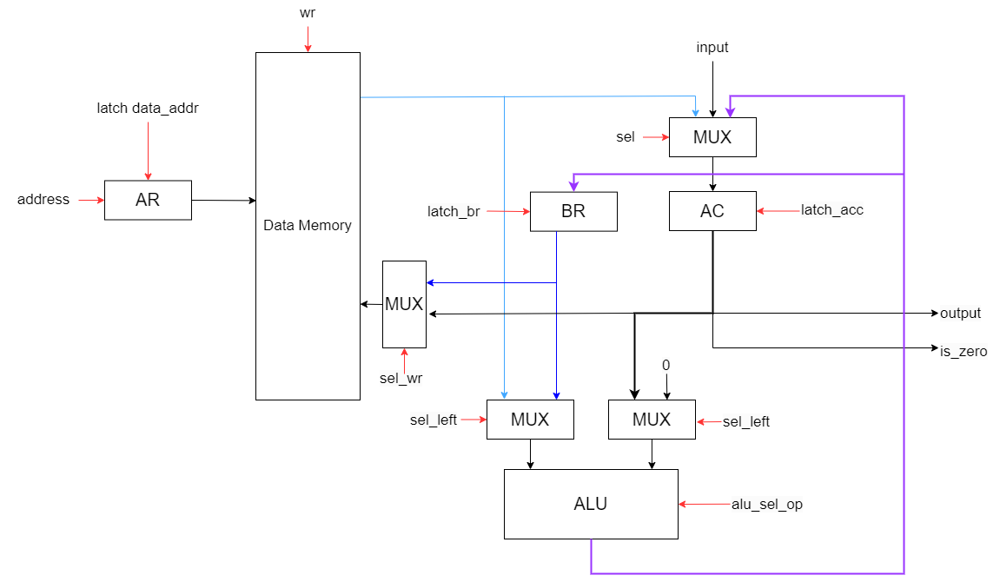
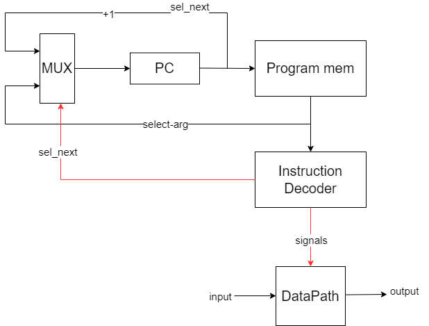

 # Asm. Транслятор и модель

- Фридкин Даниил P33111.
- `asm | cisc | harv | hw | tick | struct | stream | port | prob2`

## Язык программирования

``` ebnf
program ::= line "\n" program

line ::= label
       | command
       | section
       | variable

label ::= label_name ":" command

command ::= "\t" operation_2_args " " operand " " operand |
            "\t" operation_1_arg " " operand |
            "\t" operation_0_args |

operation_2_args ::= "mov" | "cmp" | "cmp*" | "rdiv" | "add"

operation_1_arg ::= "in" | "out" | "out#" | "out_char" | "jmp" | "je" | "sv"

operation_0_args ::= "hlt"

operand ::= variable_name | label_name | number

section ::= "." section_name

section_name ::= "text" | "data"

variable ::= variable_type " " variable_name " " variable_value

variable_type ::= "num" | "string"

label_name ::= [a-z_]+
          
variable_name ::= [a-z_]+[0-9]+

variable_value ::= number | string

string ::= "[a-zA-z0-9!@#$%^&*().,]+"

number ::= [-2^32; 2^32 - 1]

```

Код выполняется последовательно. Операции:

- `mov <arg1> <arg2>` -- присваивает второму аргументу значение первого аргумента
- `cmp <arg1> <arg2>` -- производится вычитание из второго аргумента первого с целью их сравнения 
- `cmp* <arg1> <arg2>` -- аналог cmp, но с косвенной автоинкрементной адресацией
- `rdiv <arg1> <arg2>` -- получить остаток от деления первого аргумента на второй
- `add <arg1> <arg2>` -- прибавить первый аргумент ко второму и перезаписать его в память
- `in <arg>` -- прочитать символ из потока ввода
- `out <arg>` -- вывести число в потока вывода
- `out# <arg>` -- аналог out, но с косвенной адресацией (не автоинкрементной)
- `out_char <arg>` -- вывести символ в потока вывода
- `jmp <label>` -- безусловный переход по адресу метки 
- `je <label>` -- переход по адресу метки, в случае, если выставлен zero-флаг
- `sv <arg>` -- сохраняет значение из аккумулятора в переменную
- `hlt` -- завершить выполнение программы


## Организация памяти
Модель памяти процессора:

1. Память команд. Машинное слово -- не определено. Реализуется списком словарей, описывающих инструкции (одно слово -- одна ячейка).
2. Память данных. Машинное слово -- 32 бита, знаковое. Линейное адресное пространство. Реализуется списком чисел.

Строки, объявленные пользователем распеделяются по памяти один символ на ячейку.

```text
     Instruction memory
+-----------------------------+
| 00  : cmp last divisor      |
| 01  : je end                |
|    ...                      | 
| n   : hlt                   |
|    ...                      |
+-----------------------------+

Data memory
+-----------------------------+
| 00  : number                |
| 01  : number                |
| 03  : number                |
|    ...                      |
| 98  : number                |
| 99  : number                |
| 100 : number                |
|    ...                      |
+-----------------------------+
```

## Система команд

Особенности процессора:

- Машинное слово -- 32 бит, знаковое.
- Память данных:
    - адресуется через регистр `data_address`;
    - может быть записана:
        - из аккумулятора `acc`;
        - с буферного регистра `br`;
    - может быть прочитана в аккумулятор `acc`:
- Регистр аккумулятора `acc`:
    - может быть подан на вывод;
    - используется как флаг (сравнение с 0);
- Ввод-вывод -- порты ввода/вывода, токенизирован, символьный.
- `program_counter` -- счётчик команд:
    - инкрементируется после каждой инструкции или перезаписывается инструкцией перехода.

### Набор инструкции

| Syntax         | Mnemonic        | Кол-во тактов | Comment                           |
|:---------------|:----------------|---------------|:----------------------------------|
| `mov`          | mov             | 3             | см. язык                          |
| `cmp`          | cmp             | 3             | см. язык                          |
| `cmp*`         | cmp_rel_inc     | 6             | см. язык                          |
| `rdiv`         | rdiv            | 3             | см. язык                          |
| `add`          | add             | 4             | см. язык                          |
| `in`           | in              | 2             | см. язык                          |
| `out`          | out             | 3             | см. язык                          |
| `out#`         | out_rel         | 4             | см. язык                          |
| `out_char`     | out_char        | 3             | см. язык                          |
| `jmp`          | jmp             | 1             | см. язык                          |
| `je`           | je              | 1             | см. язык                          |
| `sv`           | sv              | 2             | см. язык                          |
| `hlt`          | hlt             | 1             | см. язык                          |

### Кодирование инструкций

- Машинный код сериализуется в список JSON.
- Один элемент списка, одна инструкция.
- Индекс списка -- адрес инструкции. Используется для команд перехода.

Пример:

```json
[
   {
        "opcode": "rdiv",
        "addr": 4,
        "args": [
            3,
            0
        ]
    }
]
```

где:

- `opcode` -- строка с кодом операции;
- `addr` -- адрес команды. Очередность выполнения команды, начиная с первой в секции `.text`. Нумерация с нуля;
- `args` -- адреса аргументов от первого до последнего. Если их нет, то список пустой.

Типы данные в модуле [isa](./isa.py), где:

- `Opcode` -- перечисление кодов операций.

## Транслятор

Интерфейс командной строки: `translator.py <input_file> <target_file>`

Реализовано в модуле: [translator](./translator.py)

Этапы трансляции (функция `translate`):
1. Трансформирование текста в последовательность значимых машинных слов.
    - Переменные:
        - На этапе трансляции создается файл с данными `data_file`, в который записываются значения всех переменных. Команды оперируют адресами на них
        - Задаётся либо числовым значением, либо указателем на начало строки (используя string)
2. Проверка корректности программы (наличие нужных секций, корректность меток, переменных и т.д.).
3. Генерация машинного кода.

Правила генерации машинного кода:

- одно слово языка -- одна инструкция;
- для команд, однозначно соответствующих инструкциям -- прямое отображение;

## Модель процессора

Реализовано в модуле: [machine](./machine.py).


### DataPath



Реализован в классе `DataPath`.

Сигналы (обрабатываются за один такт, реализованы в виде методов класса):

- `wr` -- записать в data_memory
- `latch_data_address` -- защёлкнуть значение в `data_address`
- `latch_acc` -- защёлкнуть значение в `acc`
- `latch_br` -- защёлкнуть значение в `br`
- `sel` -- сигнал мультиплексору для выбора значения, подаваемого в аккумулятор
- `sel_wr` -- сигнал мультиплексору для выбора значения, записываемого в память
- `sel_left` -- сигнал мультиплексору для выбора значения, подаваемого на левый вход АЛУ
- `sel_right` -- сигнал мультиплексору для выбора значения, подаваемого на правый вход АЛУ
- `alu_sel_op` -- сигнал выбора операции в АЛУ

Флаги:

- `is_zero` -- лежит ли в аккумуляторе 0.


### ControlUnit



Реализован в классе `ControlUnit`.

- Моделирование на уровне тактов.
- Декодирование машинного кода в инструкцию и дальнейшее её выполнение: `decode_and_execute_instruction`. На схеме - Instruction Decoder


Особенности работы модели:

- Для журнала состояний процессора используется стандартный модуль logging.
- Количество инструкций для моделирования ограничено hardcoded константой.
- Поддержка сложных многотактовых иснтрукий, осуществляющих и обращения к памяти и арифметику в рамках одной команды, как в CISC-архитектурах
- Небольшое число рабочих регистров (аккумулятор и буфферный регистр) 
- Остановка моделирования осуществляется при помощи исключений:
    - `EOFError` -- если нет данных для чтения из порта ввода-вывода;
    - `StopIteration` -- если выполнена инструкция `halt`.
- Управление симуляцией реализовано в функции `simulate`.


## Апробация

В качестве тестов для `machine` и `translator` использовано 3 теста:

1. [hello world](examples/hello.asm).
2. [cat](examples/cat.asm) -- программа `cat`, повторяем ввод на выводе.
3. [prob2](examples/prob2.asm) -- программа, решающая вторую задачу Эйлера.

Golden тесты реализованы тут: [integration_test](./integration_test.py)

Пример использования и журнал работы процессора на примере `cat`:

``` console  #### todo!!!
> cat examples/cat.asm
.data:
    num tmp 0
.text:

loop: in tmp
    out_char tmp
	jmp loop
end: hlt
> cat examples/input.txt
Good news, everyone!
> ./translator.py examples/cat.asm cat_code.out
source LoC: 14 code instr: 4
> cat examples/cat_code.out
[
    {
        "opcode": "in",
        "addr": 0,
        "args": [
            0
        ]
    },
    {
        "opcode": "out_char",
        "addr": 1,
        "args": [
            0
        ]
    },
    {
        "opcode": "jmp",
        "addr": 2,
        "args": [
            0
        ]
    },
    {
        "opcode": "hlt",
        "addr": 3,
        "args": []
    }
]
> ./machine.py examples/cat_code.out examples/input.txt
DEBUG:root:{TICK: 0, ADDR: 0, PC: 0, OUT: 0, ACC: 0} 
DEBUG:root:{TICK: 1, ADDR: 0, PC: 0, OUT: 71, ACC: 71} 
DEBUG:root:{TICK: 2, ADDR: 0, PC: 1, OUT: 71, ACC: 71} 
DEBUG:root:{TICK: 3, ADDR: 0, PC: 1, OUT: 71, ACC: 71} 
DEBUG:root:output: '' << 'G'
DEBUG:root:{TICK: 4, ADDR: 0, PC: 1, OUT: 71, ACC: 71} 
DEBUG:root:{TICK: 5, ADDR: 0, PC: 2, OUT: 71, ACC: 71} 
DEBUG:root:{TICK: 6, ADDR: 0, PC: 0, OUT: 71, ACC: 71} 
DEBUG:root:{TICK: 7, ADDR: 0, PC: 0, OUT: 111, ACC: 111} 
DEBUG:root:{TICK: 8, ADDR: 0, PC: 1, OUT: 111, ACC: 111} 
DEBUG:root:{TICK: 9, ADDR: 0, PC: 1, OUT: 111, ACC: 111} 
DEBUG:root:output: 'G' << 'o'
DEBUG:root:{TICK: 10, ADDR: 0, PC: 1, OUT: 111, ACC: 111} 
DEBUG:root:{TICK: 11, ADDR: 0, PC: 2, OUT: 111, ACC: 111} 
DEBUG:root:{TICK: 12, ADDR: 0, PC: 0, OUT: 111, ACC: 111} 
DEBUG:root:{TICK: 13, ADDR: 0, PC: 0, OUT: 111, ACC: 111} 
DEBUG:root:{TICK: 14, ADDR: 0, PC: 1, OUT: 111, ACC: 111} 
DEBUG:root:{TICK: 15, ADDR: 0, PC: 1, OUT: 111, ACC: 111} 
DEBUG:root:output: 'Go' << 'o'
DEBUG:root:{TICK: 16, ADDR: 0, PC: 1, OUT: 111, ACC: 111} 
DEBUG:root:{TICK: 17, ADDR: 0, PC: 2, OUT: 111, ACC: 111} 
DEBUG:root:{TICK: 18, ADDR: 0, PC: 0, OUT: 111, ACC: 111} 
DEBUG:root:{TICK: 19, ADDR: 0, PC: 0, OUT: 100, ACC: 100} 
DEBUG:root:{TICK: 20, ADDR: 0, PC: 1, OUT: 100, ACC: 100} 
DEBUG:root:{TICK: 21, ADDR: 0, PC: 1, OUT: 100, ACC: 100} 
DEBUG:root:output: 'Goo' << 'd'
DEBUG:root:{TICK: 22, ADDR: 0, PC: 1, OUT: 100, ACC: 100} 
DEBUG:root:{TICK: 23, ADDR: 0, PC: 2, OUT: 100, ACC: 100} 
DEBUG:root:{TICK: 24, ADDR: 0, PC: 0, OUT: 100, ACC: 100} 
DEBUG:root:{TICK: 25, ADDR: 0, PC: 0, OUT: 32, ACC: 32} 
DEBUG:root:{TICK: 26, ADDR: 0, PC: 1, OUT: 32, ACC: 32} 
DEBUG:root:{TICK: 27, ADDR: 0, PC: 1, OUT: 32, ACC: 32} 
DEBUG:root:output: 'Good' << ' '
DEBUG:root:{TICK: 28, ADDR: 0, PC: 1, OUT: 32, ACC: 32} 
DEBUG:root:{TICK: 29, ADDR: 0, PC: 2, OUT: 32, ACC: 32} 
DEBUG:root:{TICK: 30, ADDR: 0, PC: 0, OUT: 32, ACC: 32} 
DEBUG:root:{TICK: 31, ADDR: 0, PC: 0, OUT: 110, ACC: 110} 
DEBUG:root:{TICK: 32, ADDR: 0, PC: 1, OUT: 110, ACC: 110} 
DEBUG:root:{TICK: 33, ADDR: 0, PC: 1, OUT: 110, ACC: 110} 
DEBUG:root:output: 'Good ' << 'n'
DEBUG:root:{TICK: 34, ADDR: 0, PC: 1, OUT: 110, ACC: 110} 
DEBUG:root:{TICK: 35, ADDR: 0, PC: 2, OUT: 110, ACC: 110} 
DEBUG:root:{TICK: 36, ADDR: 0, PC: 0, OUT: 110, ACC: 110} 
DEBUG:root:{TICK: 37, ADDR: 0, PC: 0, OUT: 101, ACC: 101} 
DEBUG:root:{TICK: 38, ADDR: 0, PC: 1, OUT: 101, ACC: 101} 
DEBUG:root:{TICK: 39, ADDR: 0, PC: 1, OUT: 101, ACC: 101} 
DEBUG:root:output: 'Good n' << 'e'
DEBUG:root:{TICK: 40, ADDR: 0, PC: 1, OUT: 101, ACC: 101} 
DEBUG:root:{TICK: 41, ADDR: 0, PC: 2, OUT: 101, ACC: 101} 
DEBUG:root:{TICK: 42, ADDR: 0, PC: 0, OUT: 101, ACC: 101} 
DEBUG:root:{TICK: 43, ADDR: 0, PC: 0, OUT: 119, ACC: 119} 
DEBUG:root:{TICK: 44, ADDR: 0, PC: 1, OUT: 119, ACC: 119} 
DEBUG:root:{TICK: 45, ADDR: 0, PC: 1, OUT: 119, ACC: 119} 
DEBUG:root:output: 'Good ne' << 'w'
DEBUG:root:{TICK: 46, ADDR: 0, PC: 1, OUT: 119, ACC: 119} 
DEBUG:root:{TICK: 47, ADDR: 0, PC: 2, OUT: 119, ACC: 119} 
DEBUG:root:{TICK: 48, ADDR: 0, PC: 0, OUT: 119, ACC: 119} 
DEBUG:root:{TICK: 49, ADDR: 0, PC: 0, OUT: 115, ACC: 115} 
DEBUG:root:{TICK: 50, ADDR: 0, PC: 1, OUT: 115, ACC: 115} 
DEBUG:root:{TICK: 51, ADDR: 0, PC: 1, OUT: 115, ACC: 115} 
DEBUG:root:output: 'Good new' << 's'
DEBUG:root:{TICK: 52, ADDR: 0, PC: 1, OUT: 115, ACC: 115} 
DEBUG:root:{TICK: 53, ADDR: 0, PC: 2, OUT: 115, ACC: 115} 
DEBUG:root:{TICK: 54, ADDR: 0, PC: 0, OUT: 115, ACC: 115} 
DEBUG:root:{TICK: 55, ADDR: 0, PC: 0, OUT: 44, ACC: 44} 
DEBUG:root:{TICK: 56, ADDR: 0, PC: 1, OUT: 44, ACC: 44} 
DEBUG:root:{TICK: 57, ADDR: 0, PC: 1, OUT: 44, ACC: 44} 
DEBUG:root:output: 'Good news' << ','
DEBUG:root:{TICK: 58, ADDR: 0, PC: 1, OUT: 44, ACC: 44} 
DEBUG:root:{TICK: 59, ADDR: 0, PC: 2, OUT: 44, ACC: 44} 
DEBUG:root:{TICK: 60, ADDR: 0, PC: 0, OUT: 44, ACC: 44} 
DEBUG:root:{TICK: 61, ADDR: 0, PC: 0, OUT: 32, ACC: 32} 
DEBUG:root:{TICK: 62, ADDR: 0, PC: 1, OUT: 32, ACC: 32} 
DEBUG:root:{TICK: 63, ADDR: 0, PC: 1, OUT: 32, ACC: 32} 
DEBUG:root:output: 'Good news,' << ' '
DEBUG:root:{TICK: 64, ADDR: 0, PC: 1, OUT: 32, ACC: 32} 
DEBUG:root:{TICK: 65, ADDR: 0, PC: 2, OUT: 32, ACC: 32} 
DEBUG:root:{TICK: 66, ADDR: 0, PC: 0, OUT: 32, ACC: 32} 
DEBUG:root:{TICK: 67, ADDR: 0, PC: 0, OUT: 101, ACC: 101} 
DEBUG:root:{TICK: 68, ADDR: 0, PC: 1, OUT: 101, ACC: 101} 
DEBUG:root:{TICK: 69, ADDR: 0, PC: 1, OUT: 101, ACC: 101} 
DEBUG:root:output: 'Good news, ' << 'e'
DEBUG:root:{TICK: 70, ADDR: 0, PC: 1, OUT: 101, ACC: 101} 
DEBUG:root:{TICK: 71, ADDR: 0, PC: 2, OUT: 101, ACC: 101} 
DEBUG:root:{TICK: 72, ADDR: 0, PC: 0, OUT: 101, ACC: 101} 
DEBUG:root:{TICK: 73, ADDR: 0, PC: 0, OUT: 118, ACC: 118} 
DEBUG:root:{TICK: 74, ADDR: 0, PC: 1, OUT: 118, ACC: 118} 
DEBUG:root:{TICK: 75, ADDR: 0, PC: 1, OUT: 118, ACC: 118} 
DEBUG:root:output: 'Good news, e' << 'v'
DEBUG:root:{TICK: 76, ADDR: 0, PC: 1, OUT: 118, ACC: 118} 
DEBUG:root:{TICK: 77, ADDR: 0, PC: 2, OUT: 118, ACC: 118} 
DEBUG:root:{TICK: 78, ADDR: 0, PC: 0, OUT: 118, ACC: 118} 
DEBUG:root:{TICK: 79, ADDR: 0, PC: 0, OUT: 101, ACC: 101} 
DEBUG:root:{TICK: 80, ADDR: 0, PC: 1, OUT: 101, ACC: 101} 
DEBUG:root:{TICK: 81, ADDR: 0, PC: 1, OUT: 101, ACC: 101} 
DEBUG:root:output: 'Good news, ev' << 'e'
DEBUG:root:{TICK: 82, ADDR: 0, PC: 1, OUT: 101, ACC: 101} 
DEBUG:root:{TICK: 83, ADDR: 0, PC: 2, OUT: 101, ACC: 101} 
DEBUG:root:{TICK: 84, ADDR: 0, PC: 0, OUT: 101, ACC: 101} 
DEBUG:root:{TICK: 85, ADDR: 0, PC: 0, OUT: 114, ACC: 114} 
DEBUG:root:{TICK: 86, ADDR: 0, PC: 1, OUT: 114, ACC: 114} 
DEBUG:root:{TICK: 87, ADDR: 0, PC: 1, OUT: 114, ACC: 114} 
DEBUG:root:output: 'Good news, eve' << 'r'
DEBUG:root:{TICK: 88, ADDR: 0, PC: 1, OUT: 114, ACC: 114} 
DEBUG:root:{TICK: 89, ADDR: 0, PC: 2, OUT: 114, ACC: 114} 
DEBUG:root:{TICK: 90, ADDR: 0, PC: 0, OUT: 114, ACC: 114} 
DEBUG:root:{TICK: 91, ADDR: 0, PC: 0, OUT: 121, ACC: 121} 
DEBUG:root:{TICK: 92, ADDR: 0, PC: 1, OUT: 121, ACC: 121} 
DEBUG:root:{TICK: 93, ADDR: 0, PC: 1, OUT: 121, ACC: 121} 
DEBUG:root:output: 'Good news, ever' << 'y'
DEBUG:root:{TICK: 94, ADDR: 0, PC: 1, OUT: 121, ACC: 121} 
DEBUG:root:{TICK: 95, ADDR: 0, PC: 2, OUT: 121, ACC: 121} 
DEBUG:root:{TICK: 96, ADDR: 0, PC: 0, OUT: 121, ACC: 121} 
DEBUG:root:{TICK: 97, ADDR: 0, PC: 0, OUT: 111, ACC: 111} 
DEBUG:root:{TICK: 98, ADDR: 0, PC: 1, OUT: 111, ACC: 111} 
DEBUG:root:{TICK: 99, ADDR: 0, PC: 1, OUT: 111, ACC: 111} 
DEBUG:root:output: 'Good news, every' << 'o'
DEBUG:root:{TICK: 100, ADDR: 0, PC: 1, OUT: 111, ACC: 111} 
DEBUG:root:{TICK: 101, ADDR: 0, PC: 2, OUT: 111, ACC: 111} 
DEBUG:root:{TICK: 102, ADDR: 0, PC: 0, OUT: 111, ACC: 111} 
DEBUG:root:{TICK: 103, ADDR: 0, PC: 0, OUT: 110, ACC: 110} 
DEBUG:root:{TICK: 104, ADDR: 0, PC: 1, OUT: 110, ACC: 110} 
DEBUG:root:{TICK: 105, ADDR: 0, PC: 1, OUT: 110, ACC: 110} 
DEBUG:root:output: 'Good news, everyo' << 'n'
DEBUG:root:{TICK: 106, ADDR: 0, PC: 1, OUT: 110, ACC: 110} 
DEBUG:root:{TICK: 107, ADDR: 0, PC: 2, OUT: 110, ACC: 110} 
DEBUG:root:{TICK: 108, ADDR: 0, PC: 0, OUT: 110, ACC: 110} 
DEBUG:root:{TICK: 109, ADDR: 0, PC: 0, OUT: 101, ACC: 101} 
DEBUG:root:{TICK: 110, ADDR: 0, PC: 1, OUT: 101, ACC: 101} 
DEBUG:root:{TICK: 111, ADDR: 0, PC: 1, OUT: 101, ACC: 101} 
DEBUG:root:output: 'Good news, everyon' << 'e'
DEBUG:root:{TICK: 112, ADDR: 0, PC: 1, OUT: 101, ACC: 101} 
DEBUG:root:{TICK: 113, ADDR: 0, PC: 2, OUT: 101, ACC: 101} 
DEBUG:root:{TICK: 114, ADDR: 0, PC: 0, OUT: 101, ACC: 101} 
DEBUG:root:{TICK: 115, ADDR: 0, PC: 0, OUT: 33, ACC: 33} 
DEBUG:root:{TICK: 116, ADDR: 0, PC: 1, OUT: 33, ACC: 33} 
DEBUG:root:{TICK: 117, ADDR: 0, PC: 1, OUT: 33, ACC: 33} 
DEBUG:root:output: 'Good news, everyone' << '!'
DEBUG:root:{TICK: 118, ADDR: 0, PC: 1, OUT: 33, ACC: 33} 
DEBUG:root:{TICK: 119, ADDR: 0, PC: 2, OUT: 33, ACC: 33} 
DEBUG:root:{TICK: 120, ADDR: 0, PC: 0, OUT: 33, ACC: 33} 
WARNING:root:Input buffer is empty!
INFO:root:output_buffer: 'Good news, everyone!'
Good news, everyone!
instr_counter: 60 ticks: 120

Process finished with exit code 0

```

| ФИО          | алг.  | code байт | code инстр. | инстр. | такт. | вариант                                                |
|--------------|-------|-----------|-------------|--------|-------|--------------------------------------------------------|
| Фридкин Д.В. | hello | -         | 6           | 52     | 161   | asm, cisc, harv, hw, tick, struct, stream, port, prob2 |
| Фридкин Д.В. | cat   | -         | 4           | 60     | 120   | asm, cisc, harv, hw, tick, struct, stream, port, prob2 |
| Фридкин Д.В. | prob2 | -         | 17          | 391    | 1317  | asm, cisc, harv, hw, tick, struct, stream, port, prob2 |
